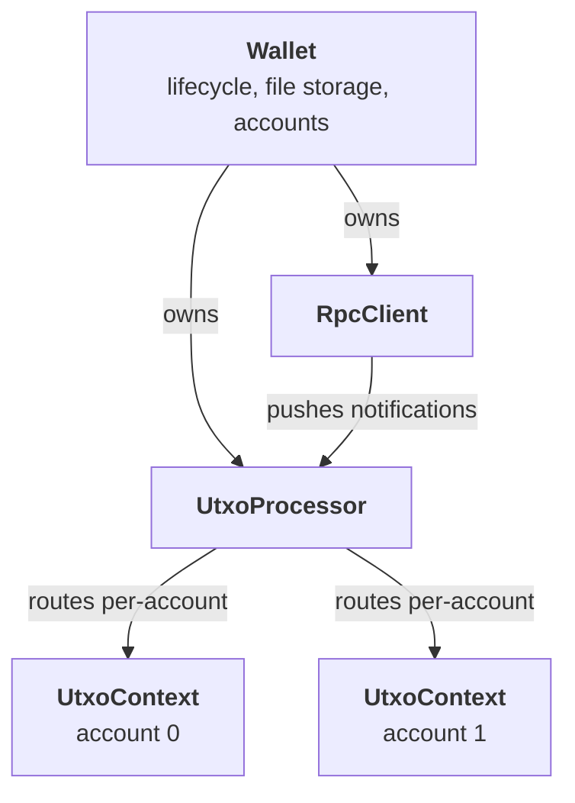

---
search:
  boost: 3
---

# Architecture

The `Wallet` class is a system of cooperating components. Knowing some of the underlying mechanics is useful for development.

This is a very brief, high-level overview.

## The pieces

| Component | Job |
| --- | --- |
| **[`Wallet`](../../reference/Classes/Wallet.md)** | Lifecycle, on-disk file storage, account list, event multiplexer. The object your code interacts with. |
| **[`RpcClient`](../../reference/Classes/RpcClient.md)** | The wRPC connection. Used internally for calls and as the source of node-pushed notifications. |
| **[`UtxoProcessor`](../../reference/Classes/UtxoProcessor.md)** | Subscribes to virtual-chain / UTXO notifications, tracks `synced` state, routes UTXO changes to the right `UtxoContext`. |
| **[`UtxoContext`](../../reference/Classes/UtxoContext.md)** | One per activated account. Holds tracked addresses, per-state balance (`mature`, `pending`, `outgoing`), and the mature UTXO set the coin selector pulls from. |

The wallet does not poll the node for UTXO state. It is fed by the
processor from notifications — see [Sync State](sync-state.md) for
what gates that flow.

## Where to next

- [Lifecycle](lifecycle.md) — the state machine and boot sequence.
- [Sync State](sync-state.md) — node IBD vs. processor readiness.
- [Send Transaction → UTXO maturity](send-transaction.md#utxo-maturity) — Pending / Mature / Outgoing
  states and why `accounts_get_utxos` can return `[]`.
- [Events](events.md) — the live event surface.
- [Transaction History](transaction-history.md) — stored records and
  annotation.
