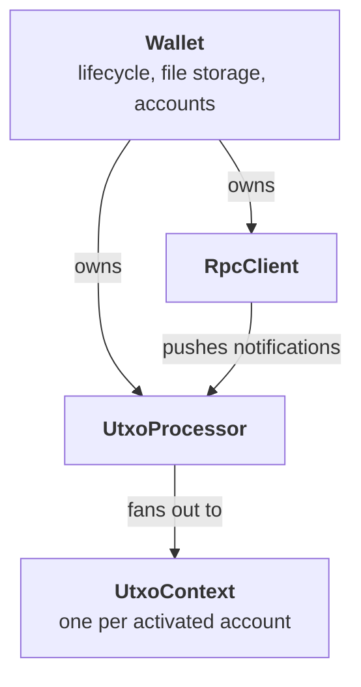

# Architecture

The `Wallet` class has quite a bit going on behind the scenes - it's a small system of cooperating
pieces. Knowing how they fit together is what makes the
[sync gate](sync-state.md) and
[transaction-history events](transaction-history.md) make sense.

## The pieces

| Component | Job |
| --- | --- |
| **[`Wallet`](../../reference/Classes/Wallet.md)** | Lifecycle, on-disk file storage, account list, event multiplexer. The thing your code calls. |
| **[`RpcClient`](../../reference/Classes/RpcClient.md)** | The wRPC connection. Used internally for calls and as the source of node-pushed notifications. |
| **[`UtxoProcessor`](../../reference/Classes/UtxoProcessor.md)** | Subscribes to virtual-chain / UTXO notifications, tracks `synced` state, routes UTXO changes to the right `UtxoContext`. |
| **[`UtxoContext`](../../reference/Classes/UtxoContext.md)** | One per activated account. Holds tracked addresses, per-state balance (`mature`, `pending`, `outgoing`), and the mature UTXO set the coin selector pulls from. |

The wallet *does not poll* the node for UTXO state. It is **fed** by
the processor from notifications — see [Sync State](sync-state.md)
for what gates that flow.

## Where to next

- [Lifecycle](lifecycle.md) — the state machine and boot sequence.
- [Sync State](sync-state.md) — node IBD vs. processor readiness.
- [UTXO Maturity](utxo-maturity.md) — Pending / Mature / Outgoing
  states and why `accounts_get_utxos` can return `[]`.
- [Transaction History](transaction-history.md) — the event surface.
