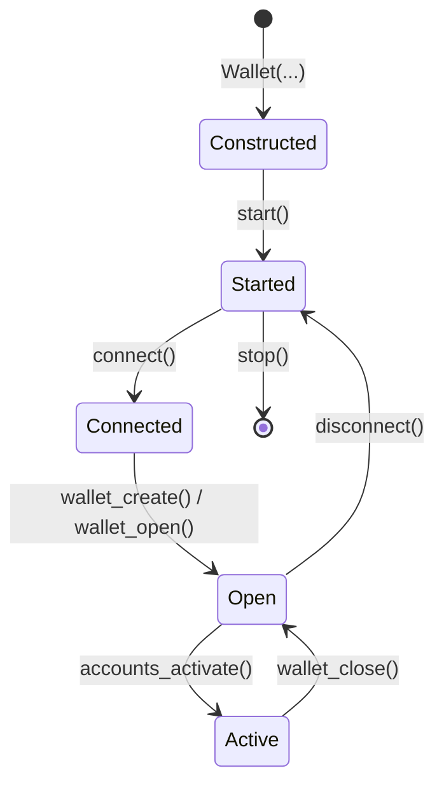

# Lifecycle

A `Wallet` moves through five states. Each transition is async and
ordered — skipping or repeating steps will either raise (e.g. opening
without `start()`) or leave the wallet in a broken state (e.g.
operating before sync).



## States and transitions

| Step | Method | Effect |
| --- | --- | --- |
| Construct | `Wallet(network_id, encoding, url, resolver)` | Builds the local file store and an internal wRPC client. No I/O. |
| Start | `await wallet.start()` | Boots the `UtxoProcessor`, the wRPC notifier, and the event-dispatch task. |
| Connect | `await wallet.connect(...)` | Connects the wRPC client to a node (via `resolver` or explicit `url`). |
| Open | `await wallet.wallet_create(...)` / `wallet_open(...)` | Decrypts and loads a wallet file; secrets become available in memory. |
| Activate | `await wallet.accounts_activate([ids])` | Begins UTXO tracking and event emission for the chosen accounts. |
| Close | `await wallet.wallet_close()` | Releases the open wallet; activated accounts stop tracking. |
| Disconnect | `await wallet.disconnect()` | Drops the wRPC connection; the wallet remains started. |
| Stop | `await wallet.stop()` | Tears down the runtime and event task. |

## Properties

| Property | Type | Meaning |
| --- | --- | --- |
| `wallet.rpc` | [`RpcClient`](../../reference/Classes/RpcClient.md) | The underlying wRPC client. Use for direct node calls. |
| `wallet.is_open` | `bool` | `True` between `wallet_open` / `wallet_create` and `wallet_close`. |
| `wallet.is_synced` | `bool` | `True` once the `UtxoProcessor` has caught up. See [Sync State](sync-state.md). |
| `wallet.descriptor` | `WalletDescriptor \| None` | Metadata for the open wallet, or `None` when closed. |

## 1.) Construct

Constructing a [`Wallet`](../../reference/Classes/Wallet.md) does no
I/O. It builds the local file store and an internal wRPC client —
that's it.

```python
from kaspa import Resolver, Wallet

wallet = Wallet(
    network_id="testnet-10",     # required in practice
    resolver=Resolver(),         # discover a public node
    # url=...                    # OR a known node URL
    # encoding="borsh",          # default; "json" also accepted
)
```

| Argument | Required | Notes |
| --- | --- | --- |
| `network_id` | effectively yes | `"mainnet"`, `"testnet-10"`, `"testnet-11"`. Drives both resolver query and address encoding. May be omitted at construction and supplied later via `set_network_id`. |
| `resolver` | one of | A [`Resolver`](../rpc/resolver.md) instance. |
| `url` | resolver/url | A known wRPC URL (`wss://node.example:17110`). Skip the resolver if set. |
| `encoding` | optional | `"borsh"` (default) or `"json"`. Borsh is right for almost everything. |

Addresses derived from this wallet are encoded for `network_id`, and
the resolver only returns nodes on that network — pin it before
`accounts_activate`.

### Switching networks

`set_network_id` raises if the wallet is currently connected:

```python
await wallet.disconnect()
wallet.set_network_id("mainnet")
await wallet.connect()
```

Switching network does not invalidate the file store, but BIP32
account *addresses* are network-specific — a key created under
`testnet-10` produces different (testnet) addresses than the same key
under `mainnet`.

### Storage location

Wallet files live in the SDK's local store (under `~/.kaspa/` by
default). The folder is created on first write — nothing happens at
construction time. The current `Wallet` constructor does not expose a
per-instance override; the location is fixed for the process.

## 2.) Start the runtime

`start()` boots the wallet's runtime — `UtxoProcessor`, wRPC notifier,
and event-dispatch loop. `connect()` then attaches the wRPC client to
a node. After both, the wallet is ready to *open a file*, but not yet
ready to touch UTXO state.

```python
wallet = Wallet(network_id="testnet-10", resolver=Resolver())
await wallet.start()
await wallet.connect()
```

Both are required. `start()` without `connect()` leaves the runtime
running but unable to reach the node; `connect()` without a prior
`start()` leaves the wallet runtime unstarted, so account activation
and event dispatch never function.

### Connect options

`connect()` takes the same options as
[`RpcClient.connect`](../rpc/connecting.md#connection-options):

```python
await wallet.connect(
    block_async_connect=True,    # await readiness before returning
    strategy="retry",            # "retry" or "fallback"
    url=None,                    # override the resolver-discovered URL
    timeout_duration=10_000,     # ms
    retry_interval=1_000,        # ms
)
```

If you constructed with a `Resolver`, omit `url` and let it pick a
public node. Pass `url=` to override for one connection (handy for
pinning to a specific node temporarily).

### Sync gate

`connect()` resolves as soon as the WebSocket is up — *not* when the
wallet's UTXO processor has caught up. Until `wallet.is_synced` flips
to `True`, UTXO-dependent calls (`AccountDescriptor.balance`,
`accounts_get_utxos`, `accounts_send`) are unusable. Quick polling
form for scripts:

```python
await wallet.connect(...)
while not wallet.is_synced:
    await asyncio.sleep(0.5)
```

For the event-driven pattern and the node-vs-processor breakdown of
what "synced" actually means, see [Sync State](sync-state.md).

## 3.) Open a wallet file

A wallet file is a single encrypted file on disk. Only one is open at
a time per `Wallet` instance.

```python
created = await wallet.wallet_create(
    wallet_secret="example-secret",
    filename="demo",
    overwrite_wallet_storage=False,
    title="demo",
    user_hint="example",
)
```

- `filename` — on-disk basename; omit for the SDK default.
- `overwrite_wallet_storage=False` — raises `WalletAlreadyExistsError`
  if the file exists; pass `True` to clobber.
- `user_hint` — stored alongside the file as a recoverable password
  hint.

To open an existing file:

```python
opened = await wallet.wallet_open(
    wallet_secret="example-secret",
    account_descriptors=True,   # include account list in the response
    filename="demo",
)
```

`account_descriptors=True` returns the account list in the response
so you can pick which to activate without a follow-up
`accounts_enumerate()`.

### Create-or-open pattern

`wallet_create` raises `WalletAlreadyExistsError` when the file
exists. The canonical idempotent boot:

```python
from kaspa.exceptions import WalletAlreadyExistsError

try:
    await wallet.wallet_create(
        wallet_secret=secret, filename="demo", overwrite_wallet_storage=False,
    )
except WalletAlreadyExistsError:
    await wallet.wallet_open(secret, True, "demo")
```

For listing, exporting, importing, renaming, and re-encrypting wallet
files, see [Wallet Files](wallet-files.md).

## Activate accounts

`accounts_activate` is what makes accounts emit balance events and
accept sends. Activation requires a connected wRPC client *and* a
synced wallet — see [Sync State](sync-state.md).

```python
await wallet.accounts_activate([acct.account_id])
# or, activate every account:
await wallet.accounts_activate()
```

Account creation, BIP32 derivation, and discovery flows live on
[Accounts](accounts.md).

## Reload

`wallet_reload(reactivate)` reboots the account runtime from cached
wallet data — no disk I/O. Pass `reactivate=True` to resume
previously active accounts; pass `False` to call `accounts_activate`
yourself. A `WalletReload` event fires either way.

## Close, disconnect, stop

```python
await wallet.wallet_close()      # release the open file; secrets leave memory
await wallet.disconnect()        # drop the wRPC link; runtime stays alive
await wallet.stop()              # tear down the runtime and event task
```

`wallet_close` does not stop the runtime — pair it with `stop()` on
shutdown. Skipping `stop()` leaks the notification task; skipping
`disconnect()` leaves the WebSocket open.

## Ordering rules

!!! warning "Preconditions"
    - `start()` must precede `connect()`, `wallet_create()`, and `wallet_open()`.
    - `wallet_create()` / `wallet_open()` may run before or after
      `connect()`, but `accounts_activate()` requires the wRPC client to
      be connected *and* the wallet to be synced (see [Sync State](sync-state.md)).
    - `set_network_id()` raises if the wRPC client is currently
      connected — `disconnect()` first, change the network, then
      `connect()` again.
    - `wallet_close()` does not stop the runtime; pair it with `stop()`
      on shutdown.

## Where to next

- [Sync State](sync-state.md) — node IBD vs. processor readiness.
- [Wallet Files](wallet-files.md) — enumerate, export, import,
  rename, change secret.
- [Private Keys](private-keys.md) — the next step after creating a
  wallet.
- [Accounts](accounts.md) — derive accounts from stored key data.
- [Architecture](architecture.md) — what `start` / `connect` /
  `activate` actually wire up.
