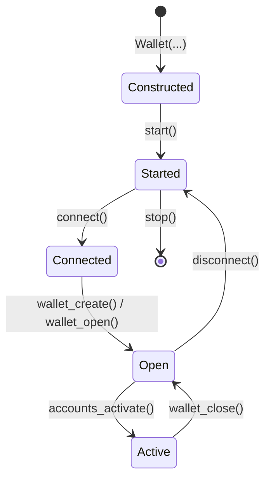

# Lifecycle

A `Wallet` moves through five states. Each transition is async and ordered
— calling them out of order raises.

## Transitions

| Step | Method | Effect |
| --- | --- | --- |
| Construct | `Wallet(network_id, encoding, url, resolver)` | Builds the local file store and an internal wRPC client. No I/O. |
| Start | `await wallet.start()` | Boots the `UtxoProcessor`, the wRPC notifier, and the event-dispatch task. |
| Connect | `await wallet.connect(...)` | Connects the wRPC client to a node (via `resolver` or explicit `url`). |
| Open | `await wallet.wallet_create(...)` / `wallet_open(...)` | Decrypts and loads a wallet file; secrets become available in memory. |
| Activate | `await wallet.accounts_activate([ids])` | Begins UTXO tracking and event emission for the chosen accounts. |
| Close | `await wallet.wallet_close()` | Releases the open wallet; activated accounts stop tracking. |
| Disconnect | `await wallet.disconnect()` | Drops the wRPC connection. The wallet remains started. |
| Stop | `await wallet.stop()` | Tears down the runtime and event task. |

## Ordering rules

!!! warning "Preconditions"
    - `start()` must precede `connect()`, `wallet_create()`, and `wallet_open()`.
    - `wallet_create()` / `wallet_open()` may be called before or after
      `connect()`, but `accounts_activate()` requires the wRPC client to be
      connected *and* the wallet to be synced (see [Start](start.md)).
    - `set_network_id()` raises if the wRPC client is currently connected
      — `disconnect()` first, change the network, then `connect()` again.
    - `wallet_close()` does not stop the runtime; pair it with `stop()` on
      shutdown.

## Properties

| Property | Type | Meaning |
| --- | --- | --- |
| `wallet.rpc` | `RpcClient` | The underlying wRPC client. Use it for direct node calls. |
| `wallet.is_open` | `bool` | `True` between `wallet_open` / `wallet_create` and `wallet_close`. |
| `wallet.is_synced` | `bool` | `True` once the `UtxoProcessor` has caught up. See [Start](start.md). |
| `wallet.descriptor` | `WalletDescriptor \| None` | Metadata for the open wallet, or `None` when closed. |

## Reload without re-reading

`wallet_reload(reactivate)` reboots the account runtime using cached wallet
data — no disk I/O. Pass `reactivate=True` to resume previously active
accounts; pass `False` if you intend to call `accounts_activate` yourself.
A `WalletReload` event fires either way.

## Where to next

- [Initialize](initialize.md), [Start](start.md), [Open](open.md) — the
  three phases of bringing a wallet up, in order.
- [Architecture](architecture.md) — what `start` / `connect` / `activate`
  actually wire up.
