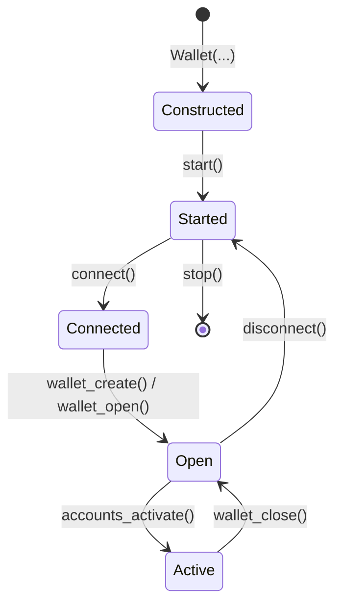

# Lifecycle

A `Wallet` moves through five states. Each transition is async and
ordered.



## States and transitions

| Step | Method | Effect |
| --- | --- | --- |
| Construct | [`Wallet(network_id, encoding, url, resolver)`](../../reference/Classes/Wallet.md#kaspa.Wallet) | Builds the local file store and an internal wRPC client. No I/O. |
| Start | [`await wallet.start()`](../../reference/Classes/Wallet.md#kaspa.Wallet.start) | Boots the `UtxoProcessor`, the wRPC notifier, and the event-dispatch task. |
| Connect | [`await wallet.connect(...)`](../../reference/Classes/Wallet.md#kaspa.Wallet.connect) | Connects the wRPC client to a node (via `resolver` or explicit `url`). |
| Open | [`await wallet.wallet_create(...)`](../../reference/Classes/Wallet.md#kaspa.Wallet.wallet_create) / [`wallet_open(...)`](../../reference/Classes/Wallet.md#kaspa.Wallet.wallet_open) | Decrypts and loads a wallet file; secrets become available in memory. |
| Activate | [`await wallet.accounts_activate([ids])`](../../reference/Classes/Wallet.md#kaspa.Wallet.accounts_activate) | Begins UTXO tracking and event emission for the chosen accounts. |
| Close | [`await wallet.wallet_close()`](../../reference/Classes/Wallet.md#kaspa.Wallet.wallet_close) | Releases the open wallet; activated accounts stop tracking. |
| Disconnect | [`await wallet.disconnect()`](../../reference/Classes/Wallet.md#kaspa.Wallet.disconnect) | Drops the wRPC connection; the wallet remains started. |
| Stop | [`await wallet.stop()`](../../reference/Classes/Wallet.md#kaspa.Wallet.stop) | Tears down the runtime and event task. |

## Properties

| Property | Type | Meaning |
| --- | --- | --- |
| [`wallet.rpc`](../../reference/Classes/Wallet.md#kaspa.Wallet.rpc) | [`RpcClient`](../../reference/Classes/RpcClient.md) | The underlying wRPC client. Use for direct node calls. |
| [`wallet.is_open`](../../reference/Classes/Wallet.md#kaspa.Wallet.is_open) | `bool` | `True` between `wallet_open` / `wallet_create` and `wallet_close`. |
| [`wallet.is_synced`](../../reference/Classes/Wallet.md#kaspa.Wallet.is_synced) | `bool` | `True` once the `UtxoProcessor` has caught up. See [Sync State](sync-state.md). |
| [`wallet.descriptor`](../../reference/Classes/Wallet.md#kaspa.Wallet.descriptor) | `WalletDescriptor \| None` | Metadata for the open wallet, or `None` when closed. |

## Construct

Constructing a [`Wallet`](../../reference/Classes/Wallet.md) does no
I/O. It builds the local file store and an internal wRPC client.

```python
from kaspa import Resolver, Wallet

wallet = Wallet(
    network_id="testnet-10",     # required in practice
    resolver=Resolver(),         # discover a public node
    # url=...                    # OR a known node URL
    # encoding="borsh",          # default; "json" also accepted
)
```

| Argument | Required | Notes |
| --- | --- | --- |
| `network_id` | effectively yes | `"mainnet"`, `"testnet-10"`, `"testnet-11"`. Drives both resolver query and address encoding. May be omitted at construction and supplied later via `set_network_id`. |
| `resolver` | one of | A [`Resolver`](../rpc/resolver.md) instance. |
| `url` | resolver/url | A known wRPC URL (`wss://node.example:17110`). Skip the resolver if set. |
| `encoding` | optional | `"borsh"` (default) or `"json"`. Borsh is right for almost everything. |

Addresses derived from this wallet are encoded for `network_id`, and
the resolver only returns nodes on that network.

### Switching networks

`set_network_id` raises if the wallet is currently connected:

```python
await wallet.disconnect()
wallet.set_network_id("mainnet")
await wallet.connect()
```

Switching network does not invalidate the file store, but BIP32
account *addresses* are network-specific — a key created under
`testnet-10` produces different addresses than the same key under
`mainnet`.

### Storage location

Wallet files live in the SDK's local store (under `~/.kaspa/` by
default). The folder is created on first write. The current `Wallet`
constructor does not expose a per-instance override; the location is
fixed for the process.

## Start and connect

`start()` boots the runtime. `connect()` attaches the wRPC client to a
node.

```python
await wallet.start()
await wallet.connect(strategy="fallback", timeout_duration=5_000)
```

`start()` without `connect()` leaves the runtime running but unable to
reach the node. `connect()` without a prior `start()` leaves the
wallet runtime unstarted, so account activation and event dispatch
never function.

### Connect options

`connect()` takes the same options as
[`RpcClient.connect`](../rpc/connecting.md#connection-options) —
`block_async_connect`, `strategy`, `url`, `timeout_duration`,
`retry_interval`. Pass `url=` to override the resolver-discovered node
for one connection.

### Sync gate

[`connect()`](../../reference/Classes/Wallet.md#kaspa.Wallet.connect) resolves as soon as the WebSocket is up — not when the
processor has caught up. UTXO-dependent calls
([`AccountDescriptor.balance`](../../reference/Classes/AccountDescriptor.md), [`accounts_get_utxos`](../../reference/Classes/Wallet.md#kaspa.Wallet.accounts_get_utxos), [`accounts_send`](../../reference/Classes/Wallet.md#kaspa.Wallet.accounts_send))
wait on [`wallet.is_synced`](../../reference/Classes/Wallet.md#kaspa.Wallet.is_synced). Quick polling form for scripts:

```python
while not wallet.is_synced:
    await asyncio.sleep(0.5)
```

For the event-driven pattern and the node-vs-processor breakdown, see
[Sync State](sync-state.md).

## Open a wallet file

A wallet file is a single encrypted file on disk. Only one is open at
a time per `Wallet` instance.

```python
created = await wallet.wallet_create(
    wallet_secret="example-secret",
    filename="demo",
    overwrite_wallet_storage=False,
    title="demo",
    user_hint="example",
)
```

- `filename` — on-disk basename; omit for the SDK default.
- `overwrite_wallet_storage=False` — raises [`WalletAlreadyExistsError`](../../reference/Exceptions/WalletAlreadyExistsError.md)
  if the file exists; pass `True` to overwrite.
- `user_hint` — stored alongside the file as a recoverable password
  hint.

To open an existing file:

```python
opened = await wallet.wallet_open(
    wallet_secret="example-secret",
    account_descriptors=True,
    filename="demo",
)
```

`account_descriptors=True` returns the account list in the response so
you can pick which to activate without a follow-up
[`accounts_enumerate()`](../../reference/Classes/Wallet.md#kaspa.Wallet.accounts_enumerate).

### Create-or-open pattern

```python
from kaspa.exceptions import WalletAlreadyExistsError

try:
    await wallet.wallet_create(
        wallet_secret=secret,
        filename="demo",
        overwrite_wallet_storage=False,
    )
except WalletAlreadyExistsError:
    await wallet.wallet_open(
        wallet_secret=secret,
        account_descriptors=True,
        filename="demo",
    )
```

For listing, exporting, importing, renaming, and re-encrypting wallet
files, see [Wallet Files](wallet-files.md).

## Reload

[`wallet_reload(reactivate)`](../../reference/Classes/Wallet.md#kaspa.Wallet.wallet_reload) reboots the account runtime from cached
wallet data without disk I/O. Pass `reactivate=True` to resume
previously active accounts. A `WalletReload` [event](events.md) fires either way.
Useful after upstream account-state changes; you usually don't need
it.

## Close, disconnect, stop

```python
await wallet.wallet_close()      # release the open file; secrets leave memory
await wallet.disconnect()        # drop the wRPC link; runtime stays alive
await wallet.stop()              # tear down the runtime and event task
```

`wallet_close` does not stop the runtime — pair it with `stop()` on
shutdown. Skipping `stop()` leaks the notification task; skipping
`disconnect()` leaves the WebSocket open.

## Ordering rules

!!! warning "Preconditions"
    - [`start()`](../../reference/Classes/Wallet.md#kaspa.Wallet.start) must precede [`connect()`](../../reference/Classes/Wallet.md#kaspa.Wallet.connect), [`wallet_create()`](../../reference/Classes/Wallet.md#kaspa.Wallet.wallet_create), and [`wallet_open()`](../../reference/Classes/Wallet.md#kaspa.Wallet.wallet_open).
    - [`wallet_create()`](../../reference/Classes/Wallet.md#kaspa.Wallet.wallet_create) / [`wallet_open()`](../../reference/Classes/Wallet.md#kaspa.Wallet.wallet_open) may run before or after
      [`connect()`](../../reference/Classes/Wallet.md#kaspa.Wallet.connect), but [`accounts_activate()`](../../reference/Classes/Wallet.md#kaspa.Wallet.accounts_activate) requires the wRPC client to
      be connected and the wallet to be synced (see [Sync State](sync-state.md)).
    - [`set_network_id()`](../../reference/Classes/Wallet.md#kaspa.Wallet.set_network_id) raises if the wRPC client is currently
      connected — [`disconnect()`](../../reference/Classes/Wallet.md#kaspa.Wallet.disconnect) first, change the network, then
      [`connect()`](../../reference/Classes/Wallet.md#kaspa.Wallet.connect) again.
    - [`wallet_close()`](../../reference/Classes/Wallet.md#kaspa.Wallet.wallet_close) does not stop the runtime; pair it with [`stop()`](../../reference/Classes/Wallet.md#kaspa.Wallet.stop)
      on shutdown.

## Where to next

- [Wallet Files](wallet-files.md) — enumerate, export, import,
  rename, change secret.
- [Private Keys](private-keys.md) — the next step after creating a
  wallet.
- [Accounts](accounts.md) — derive accounts from stored key data.
- [Sync State](sync-state.md) — node IBD vs. processor readiness.
- [Errors](errors.md) — common exceptions and their fixes.
